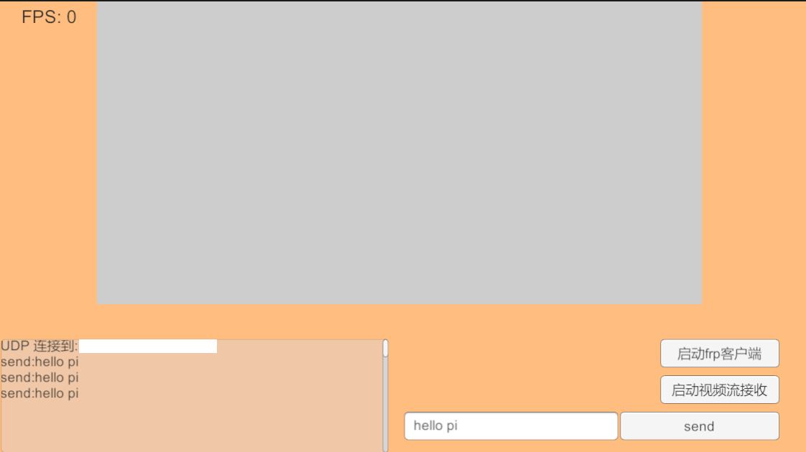
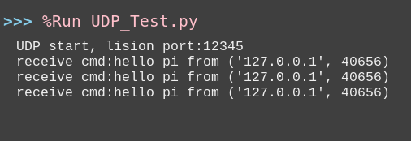
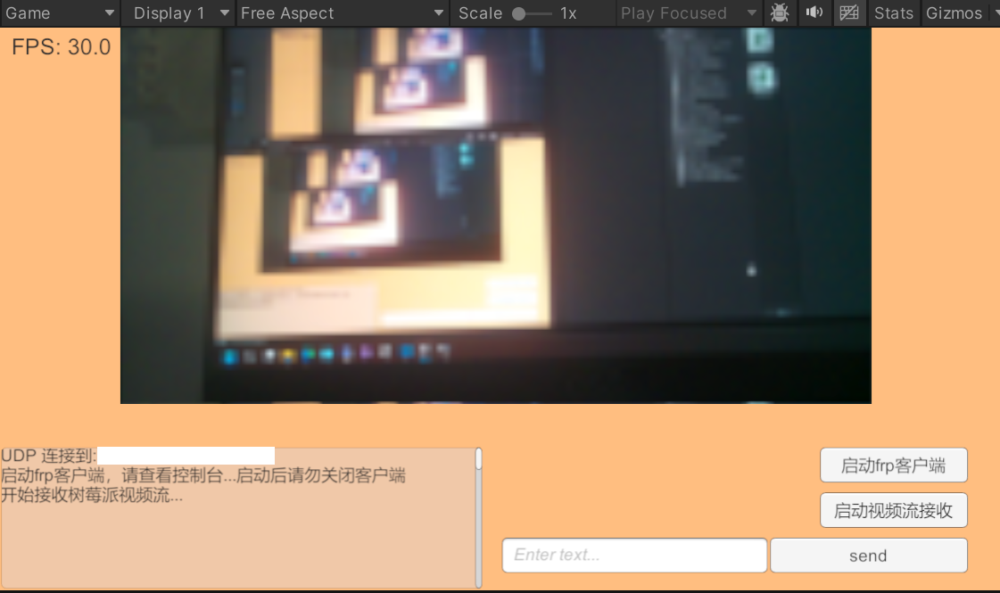

# 基于UDP协议的Unity与树莓派的远程通信

本项目为解决Unity与树莓派的远程通信以及低时延视频流传输提供了一种基于UDP协议的解决方案

## 实现的功能

1. Unity端可以向树莓派发送控制信息

  <figure>
    
    <figcaption style="font-size:0.9em;color:#666;">图1：Unity端发送“hello pi”</figcaption>
  </figure>

  <figure>
    
    <figcaption style="font-size:0.9em;color:#666;">图2：树莓派Python端接收到“hello pi”</figcapture>
  </figure>

2. Unity端可以接收树莓派端发送的实时视频流

  <figure>
    
    <figcaption style="font-size:0.9em;color:#666;">图3：Unity端接收视频流</figcapture>
  </figure>

## 使用场景

## 如何实现的

## 遇到的问题

## 可优化的地方
