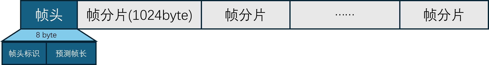

# 基于UDP协议的Unity与树莓派的远程通信

本项目为解决Unity与树莓派的远程通信以及低时延视频流传输提供了一种基于UDP协议的解决方案

---

## 实现的功能

1. Unity端可以向树莓派发送控制信息

   <p align="center">
      <a>
          
          <br>
          <b>图1: Unity端向树莓派发送"hello pi"</b>
      </a>
    </p>

   <p align="center">
      <a>
          
          <br>
          <b>图2: 树莓派端接收到Unity发送的"hello pi"</b>
      </a>
    </p>
2. Unity端可以接收树莓派端发送的实时视频流

   <p align="center">
      <a>
          
          <br>
          <b>图3: Unity端接收树莓派发送的实时视频流</b>
      </a>
    </p>

---

## 应用场景

最近在做一个远程小车的项目, 控制端采用Unity制作
这个项目可以先为此打下技术基础, 并在此基础上进行后续开发

### 还有其它地方可以用到

1. 物联网远程控制与实时监测
2. 远程视频监控
3. 遥操作设备
......

---

## 如何实现的

简单来说就是利用UDP协议无连接, 低时延的特点将数据进行传输
然后为了实现远程控制, 需要让Unity和树莓派都作为frp客户端, 同时在阿里云ECS服务器上部署frp服务器端
Unity端发送的UDP数据会先发送给frp服务器, 然后通过服务器再转发给部署有frpc的树莓派端
树莓派端的视频流数据发送给Unity也是同理

### 用了哪些东西

* ***硬件***
  
1. 从学长那白嫖的树莓派4b
2. 随便拿的一根网线 (用于连接树莓派和电脑)
3. 拼夕夕上买的树莓派摄像头 (应该不是官方的)

* ***软件***

1. Unity版本: 2022.3.53f1c1
2. 树莓派系统: Debian GNU/Linux 12 (bookworm)
3. 使用的相关Python库: picamera2, numpy
4. FRP内网穿透小工具: 0.65.0版本

* ***其它***

1. 三个月试用的阿里云ECS服务器
2. 聪明的AI助手

### 部署流程与方法

* ***FRP服务器端的配置***

1. **首先下载[FRP](https://github.com/fatedier/frp)**
2. **配置frps.toml**

     ```text
     bindPort = XXXX  # 服务器与客户端的通信端口, 默认为7000
     auth.token = "secret_token"  # 你的神奇小密码, 客户端需要一致

     # Dashboard配置 (可选, 如果需要的话)

     # 日志配置 (可选, 如果需要的话)
     ```
3. **frps, 启动!**
     *注意: 安全组需要开放上述使用的端口(frp 的服务器端与客户端之间的初始连接使用 TCP 协议)*
     配置frps为系统服务 (开机自启)

     * 创建服务文件 `nano /etc/systemd/system/frps.service`
     * 添加内容:

       ```text
       [Unit]
       Description=Frp Server Service
       After=network.target

       [Service]
       Type=simple
       Restart=on-failure
       RestartSec=5s
       ExecStart=/usr/local/frp/frps -c /usr/local/frp/frps.toml
       LimitNOFILE=1048576

       [Install]
       WantedBy=multi-user.target
       ```

  * 加载并启动服务:

    ```bash
    systemctl daemon-reload
    systemctl enable frps
    systemctl start frps
    ```
  * 检查状态: 输入 `systemctl status frps` 应显示 `active (running)`
* ***树莓派FRP客户端的配置***

1. 依旧要先下载FRP, **注意必须要和服务器端版本相同, 都是0.65.0**
2. **配置frpc.toml**

     ```text
     serverAddr = "你的ECS公网ip"
     serverPort = XXXX  # 和服务器上的bindPort一致
     auth.token = "secret_token"  # 你的神奇小密码, 和frps.toml上的一致

     [[proxies]]
     name = "随便什么名字都行"  # 我取的是test_udp
     type = "udp"
     localIP = "127.0.0.1"
     localPort = XXXXX  # 本地端口, 需要跟之后的python代码中监听的端口一致
     remotePort = XXXXX  # 云端暴露的公网端口(需要ECS安全组开放)
     ```
3. **frpc, 启动!**
     配置frpc为系统服务 (开机自启)

     * 创建服务文件 `nano /etc/systemd/system/frpc.service`
     * 添加内容:

       ```text
       [Unit]
       Description=Frp Client Service
       After=network.target
       Wants=network.target

       [Service]
       Type=simple
       Restart=on-failure
       RestartSec=5s
       ExecStart=/usr/local/frp/frpc -c /usr/local/frp/frpc.toml

       [Install]
       WantedBy=multi-user.target
       ```

  * 加载并启动服务:

    ```bash
    systemctl daemon-reload
    systemctl enable frpc
    systemctl start frpc
    ```
  * 检查状态: 输入 `systemctl status frpc` 应显示 `active (running)`
* ***不用那么麻烦的办法***
  为了让Unity端能够接收到树莓派发送过来的视频流数据, 因此也需要在运行着Unity的设备上部署frp客户端
  但是我已经写了一个批处理文件 `frpc_setup.bat`在windows上部署frpc了, 不过有些地方需要注意:

  1. 安装frp的版本和安装位置, 安装在Unity可执行文件的同目录下
     ```bash
     set "FRP_VERSION=0.65.0"       
     set "FRP_DIR=%~dp0frp_%FRP_VERSION%"
     ```
  2. frpc.toml配置文件信息的写入
     ```bash
     echo serverAddr = "你的公网ip" >> "%INI_FILE%"
     echo serverPort = XXXX >> "%INI_FILE%"  # 和服务器上的bindPort一致
     echo auth.token = "神奇小密码" >> "%INI_FILE%"

     echo. >> "%INI_FILE%"
     echo [[proxies]] >> "%INI_FILE%"
     echo name = "udp-receive" >> "%INI_FILE%"
     echo type = "udp" >> "%INI_FILE%"
     echo localIP = "127.0.0.1" >> "%INI_FILE%"
     echo localPort = XXXXX >> "%INI_FILE%"  # 本地端口, 需要跟之后的C#代码中监听的端口一致
     echo remotePort = XXXXX >> "%INI_FILE%"  # 云端暴露的公网端口(需要ECS安全组开放)
     ```
  3. 双击 `frpc_setup.bat`即可在电脑上自动配置frpc了

### 代码中需要注意的地方

* ***Unity端的C#代码***

  * 在 `UDPCtrl.cs`脚本中需要配置frp服务器的IP和本地消息发送的端口
    ```csharp
    // ...existing code...

    [Header("FRP服务器IP")]
    public string serverIP;  // 修改为服务器公网ip

    [Header("UDP消息发送")]
    public int MSG_SEND_PORT;  // unity向frp服务器发送消息的端口, 和树莓派frpc.toml中的remotePort一致
    private UdpClient udpSendClient;

    // ...existing code...
    ```
  * 在 `ReceiveCamData.cs`脚本中需要配置Unity监听的端口
    ```csharp
    // ...existing code...

    [Header("视频流接收")]
    public int MSG_RECEIVE_PORT  // Unity监听frp服务器端口, 和本机frpc.toml中的localPort一致
    public RawImage display;       
    private Texture2D texture;

    // ...existing code...
    ```
  * 以上属性均为 `public`, 所以要在Unity Editor的inspector中修改
* ***树莓派端的Python代码***

  * 在 `UDP_Test.py`中需要配置树莓派端的监听端口, 我这里默认 `12345`
    ```python
    # ...existing code...

    ser = serial.Serial('/dev/tty50', baudrate=115200, timeout=0.01)
    UDP_IP = '0.0.0.0'
    UDP_PORT = 12345  # 树莓派端监听frp服务器端口, 和树莓派frpc.toml中的localPort一致

    # ...existing code...
    ```
  * 在 `video_stream.py`中配置frp服务器的IP和本地消息发送的端口
    ```python
    # ...existing code...

    UDP_IP = "服务器公网ip"
    UDP_PORT = 13300  # 树莓派端向frp服务器发送消息的端口, 和Unity端frpc.toml中的remotePort一致

    # ...existing code...
    ```

### 如何实现视频流传输的

* **树莓派端发送视频流**

  1. 将一帧视频数据分成两部分, 帧头和视频帧数据

    <p align="center">
      <a>
        
        <br>
        <b>图4: 视频帧</b>
        <br>
        <sub>其中帧头包括帧头标识(自定义)和预测帧长, 各占4字节</sub>
      </a>
    </p>

  2. 将一整个帧数据分成小的帧分片, 每个分片1024字节

* **Unity端接收视频流**
  
  1. 在`ReceiveUDPdata`子线程中先将接收到的数据放入`dataQueue`中, 等待主线程处理
  2. 主线程处理`dataQueue`中的数据, 分为一下步骤
    * *帧头检测*
      为实现Unity接收和树莓派发送的帧同步, 需要根据帧头标识判断当前接收到的是否为帧头.
      如果接收到的不是帧头, 而是1024字节的帧分片的话, 则丢弃这个数据, 直到接收到的是8字节的帧头.
    * *接收帧分片并拼接帧数据*
      当接收到帧头后, 记录预测帧长. 开始接收当前帧数据, 将接收到的帧分片数据拼接并放入帧处理缓存中.
    * *渲染当前帧*
      当缓存中的帧长达到预测帧长时候, 则表示这一帧接收完成, 开始渲染当前帧.

* **遇到的小问题**
  最初进行视频流传输测试的时候, 发现视频画面中的红色和蓝色反了, 并且整个画面是上下左右都颠倒的

    <p align="center">
      <a>
        
        <br>
        <b>图5: 蓝色妖姬</b>
        <br>
        <sub>红蓝反相, 画面颠倒</sub>
      </a>
    </p>
  
  于是我怀疑是树莓派端发送的字节流和Unity端接收的字节流顺序是反的. 
  也就是说本来是第一个像素点的RGB数据在Unity端解码后变成了最后一个像素点的BGR数据了.
  为了解决这个问题, 我修改了树莓派上的`video_stream.py`的代码:

  ``` python
  # ...existing code...

  array = picam.capture_array()
  frame_data = array.tobytes()[::-1]  # 将帧字节数组取反再发送

  # ...existing code...
  ```

  同时我在Unity Editor中用于显示视频流的RawImage组件的x轴缩放修改为-1

    <p align="center">
      <a>
        
        <br>
        <b>图6: 修改RawImage的x轴缩放</b>
      </a>
    </p>
 
  这样一来就解决了颜色反相和画面颠倒的问题了.

---

## 可优化的地方

* **清晰的画质**
  受限于树莓派和算法的处理能力, 目前只能实现128*64分辨率的实时视频流传输
* **更高的帧率**
  目前视频流的传输能够稳定在30帧
* **更好的编码**
  当前并未对视频流做任何的编码处理, 传输的是原始视频
* **更低的时延**
  在校园网情况下, 当前的传输时延大约在80ms到150ms之间.
  这基本能满足远程小车的实时控制, 但是对于更高要求的使用场景来说需要进一步优化
