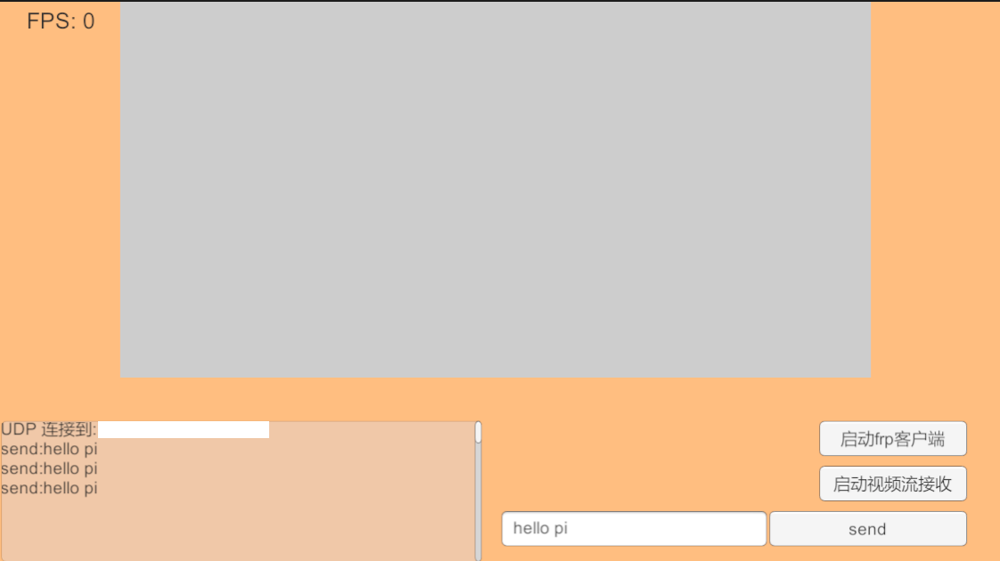
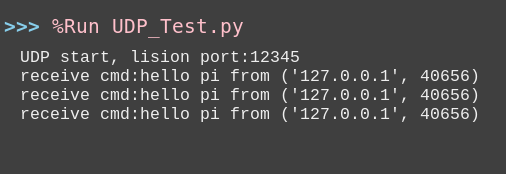
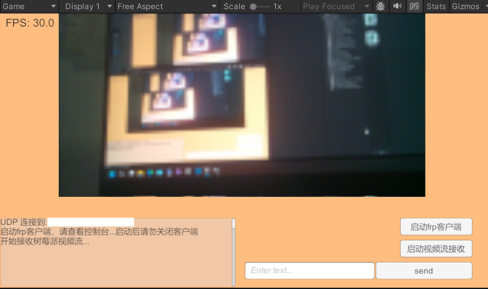
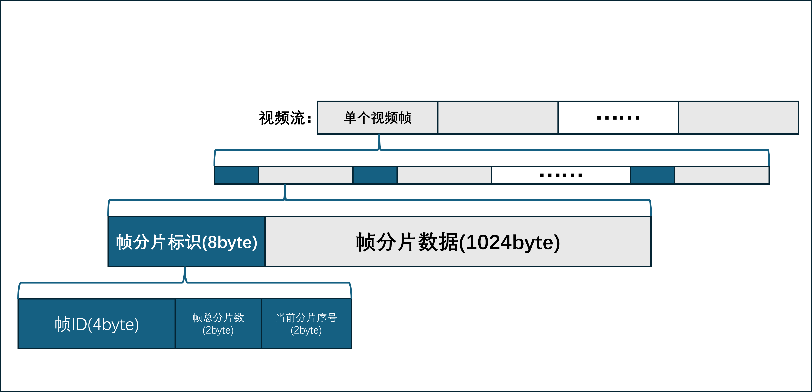

# Remote Communication of Unity and Raspberry Based on UDP Protocol

This project provide the public with a solution based on UDP protocol to achieve remote communication and low-latency video streaming of Unity and Raspberry

**Read this in other language: [simplified Chinese](README.md)**

---

CLICK [HERE](https://www.bilibili.com/video/BV13zs6zLE2d/?share_source=copy_web&vd_source=863f12bd925f05bc191eaabe35953fa6) to preview what I am doing here

## Functions Achieved

1. Raspberry is capable to receive control information sent by the Unity game project

   <p align="center">
      <a>
          
          <br>
          <b>pic01: Unity sending "hello pi" to Raspberry</b>
      </a>
    </p>

   <p align="center">
      <a>
          
          <br>
          <b>pic02: Raspberry recieving "hello pi" from Unity</b>
      </a>
    </p>
2. Unity is also capable to receive live video stream from Raspberry

   <p align="center">
      <a>
          
          <br>
          <b>pic03: Unity recieving live video stream from Raspberry</b>
      </a>
    </p>

---

## Application Scenes

I've been carrying a project of little remote control smart car and made the control terminal with Unity

This project may bring me some basic technology informations and convenience for further development

### Other Likely Applications

1. IOT remote control and real-time monitoring
2. Remote video monitor
3. Remote operation devices
   
   ......

---

## How To Make It

In a word, this project make use of UDP protocol characters of non-connection and low-latency to transmit data

In order to achieve remote control, Unity and Raspberry are set as clients with frp servers deployed in ECS server of Alibaba Cloud

The UDP data sent by Unity heads first directly to the frp server and then is relayed to Raspberry equipped with frpc there.

It is very the same for Raspberry to sent video stream data to Unity.

### Things I used

* ***Hardware***

1. Raspberry 4b handed down to me by predecessor at colledge
2. A web wire with no brand to connect Raspberry and PC
3. Raspberry camera, probably not official camera, bought from Pinduoduo, which is the Chinese version of Temu

* ***Software***

1. Unity version: 2022.3.62f2c1
2. Raspberry System: Debian GNU/Linux 12 (bookworm)
3. Python Library used: picamera2
4. FRP, AKA, Intranet penetrate tool: 0.65.0

* ***Others***

1. AlibabaCloud ECS server with my three-month free trial
2. Helpful AI assistance

### Deploy Process and Method

* ***Deployment of FRP Server***

1. **DOWNLOAD [FRP](https://github.com/fatedier/frp), which I have already put under my filefolder of the Unity project**
2. **Deploy frps.toml**

   ```text
   bindPort = XXXX  # the communication port of server and client, which is 7000 by dedfault
   auth.token = "secret_token"  # YOUR PASSWORD, stay the same as the client one

   # Dashboard Deployment (Optional, if you need it)

   # Diary Log (Optional too)
   ```
3. **frps, SWITCH ON!**
   
   *CAUTION: The ports above need to be open for the security(TCP is used in initial connection between frp server and client)*
   
   Deploy frps to serve for the system, which is automatically switch on as the PC is open on

   * Create the service file `nano /etc/systemd/system/frps.service`
   * Add content below:

     ```text
     [Unit]
     Description=Frp Server Service
     After=network.target

     [Service]
     Type=simple
     Restart=on-failure
     RestartSec=5s
     ExecStart=/usr/local/frp/frps -c /usr/local/frp/frps.toml
     LimitNOFILE=1048576

     [Install]
     WantedBy=multi-user.target
     ```

   * Load and start the service:

     ```bash
     systemctl daemon-reload
     systemctl enable frps
     systemctl start frps
     ```
     
   * Check the status: Input `systemctl status frps` and it ought to display like `active (running)`

* ***Deployment of Raspberry FRP Client***

1. Download FRP, **The version has to be the exact same version with that of the server, 0.65.0**
2. **Deploy frpc.toml**

   ```text
   serverAddr = "Your ECS Public Network ip"
   serverPort = XXXX  # The Same as the bindPort of the server
   auth.token = "secret_token"  # Your own password, the same as the frps.toml one

   [[proxies]]
   name = "WHATEVER NAME YOU LIKE"  # Mine is test_udp
   type = "udp"
   localIP = "127.0.0.1"
   localPort = XXXXX  # Local Port, stay the same as the monitor port later in the python code
   remotePort = XXXXX  # Exposed Public Network Port in the Cloud, which needs to be open by the ECS security
   ```
3. **frpc, SWITCH ON!**
   
   Deploy frpc to serve for the system, which is also automatically start up with the open of the PC

   * Create service file `nano /etc/systemd/system/frpc.service`
   * Add content below:

     ```text
     [Unit]
     Description=Frp Client Service
     After=network.target
     Wants=network.target

     [Service]
     Type=simple
     Restart=on-failure
     RestartSec=5s
     ExecStart=/usr/local/frp/frpc -c /usr/local/frp/frpc.toml

     [Install]
     WantedBy=multi-user.target
     ```

   * Load and start up the service:

     ```bash
     systemctl daemon-reload
     systemctl enable frpc
     systemctl start frpc
     ```
   * Check the status: Input `systemctl status frpc` to display `active (running)`

* ***Not That Complicated Way***
  
  To receive video stream sent by Raspberry with Unity, the devices running Unity are also called for frp client deployment
  However, I have provided you with a .bat file `frpc_setup.bat` to deploy frpc on Windows 
  BUT there are still something need to be paid attention to:

1. The location frp is installed should be the same one as the Unity executable file and the version again, 0.65.0, which is very important
     ```bash
     set "FRP_VERSION=0.65.0"     
     set "FRP_DIR=%~dp0frp_%FRP_VERSION%"
     ```
2. Write the deployment file of frpc.toml
     ```bash
     echo serverAddr = "Your Public Network ip" >> "%INI_FILE%"
     echo serverPort = XXXX >> "%INI_FILE%"  # bindport of the server
     echo auth.token = "YOUR PASSWORD" >> "%INI_FILE%"

     echo. >> "%INI_FILE%"
     echo [[proxies]] >> "%INI_FILE%"
     echo name = "udp-receive" >> "%INI_FILE%"
     echo type = "udp" >> "%INI_FILE%"
     echo localIP = "127.0.0.1" >> "%INI_FILE%"
     echo localPort = XXXXX >> "%INI_FILE%"  # Local Port, stay the same as the monitor port later in the C# code
     echo remotePort = XXXXX >> "%INI_FILE%"  # Exposed Public Network Port in the Cloud, which needs to be open by the ECS security
     ```
3. Double Click `frpc_setup.bat` and frpc is automatically deployed on the PC

### Things Need to pay attention in the code

* ***Unity C# Code***

  * Deploy port to send local message and frp sercer ip in `UDPCtrl.cs` script
    ```csharp
    // ...existing code...

    private string serverIP = "Server Public Network IP Address";  // Alter it to your own one

    private int MSG_SEND_PORT = 12300;  // Port Unity send message to frp server
    private UdpClient udpSendClient;

    // ...existing code...
    ```
  * Deploy Unity monitor port used in `ReceiveCamData.cs` script
    ```csharp
    // ...existing code...

    [Header("Video Stream Recieving")]
    public int MSG_RECEIVE_PORT;  // Unity monitor port of frp server, the same as localPort in frpc.toml in this computer
    public RawImage display;     
    private Texture2D texture;

    // ...existing code...
    ```

* ***Raspberry Python Code***

  * Deploy Raspberry monitor port needed in `Pi.py`, `12345` by default
    ```python
    # ...existing code...

    # UDP instructions reception deployment
    UDP_CTRL_IP    = "0.0.0.0"
    UDP_CTRL_PORT  = 12345          # Raspberry monitor frp server port, the same as localPort in frpc.toml

    # ...existing code...
    ```
  * Deploy frp server IP and port to send local message in `Pi.py`
    ```python
    # ...existing code...

    SERVER_IP      = "Public Network IP of The Server"
    UDP_VIDEO_PORT = 13300          # Port Raspberry used to send message to frp server, the same as remotePort in Unity frpc.toml

    # ...existing code...
    ```

### How to Accomplish Video Stream Transmission

* **Raspberry send video stream**

1. Divide one frame into multiple video slices, each of which include frame slice tag and data

  <p align="center">
      <a>
        
        <br>
        <b>pic04: video frame</b>
        <br>
      </a>
    </p>

2. Each slice are 1024 bytes with a head tag
   
   * Frame ID: Slices from the same frame have the same ID
   * Gross number of frame: how much slices are exactly one frame divided into
   * Current slice serial number: which number is it corresponded in the slice queue

* **Unity Receive Video Stream**

0. Encoding the video frame with JPEG to reduce the transmission of data
1. Data received are first put into `dataQueue` in the child thread `ReceiveUDPdata`, waiting for further process of the main thread
2. There are several steps for main thread to process data in `dataQueue`

   * *Parse data from frame slices£¨frame ID£¬frame gross slice number and slice ID£©*
    
   * *Extract slice data*
    
   * *Omit time-out frame data*
  
   * *Deal with the slice data*
   
   * *Combination and parse after receiving one frame of data*
   
---

## Things still need optimization

* **Higher FPS**
  The video stream transmisson is stable at 30fps with the bandwidth of ECS server 10Mbps

* **Lower Latency**
  With the network environment in my university, current latency is roughly between 80ms and 150ms
  This basically meets the requirements to control a remote car in real time, all of which, however, needs further optimization in an application of higher demands
